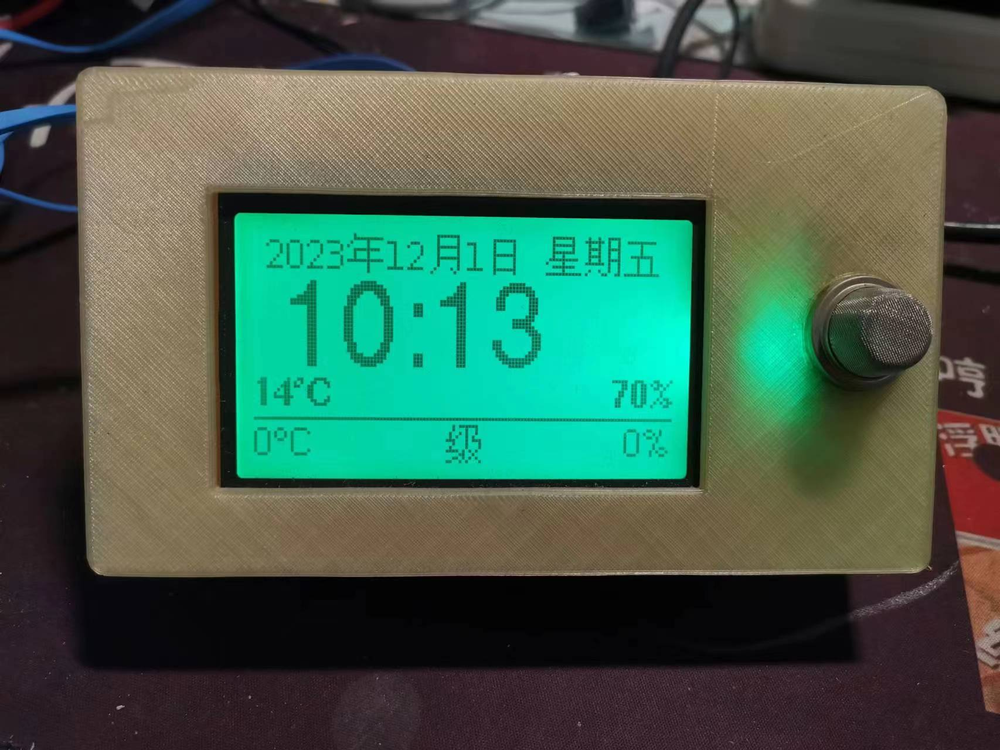
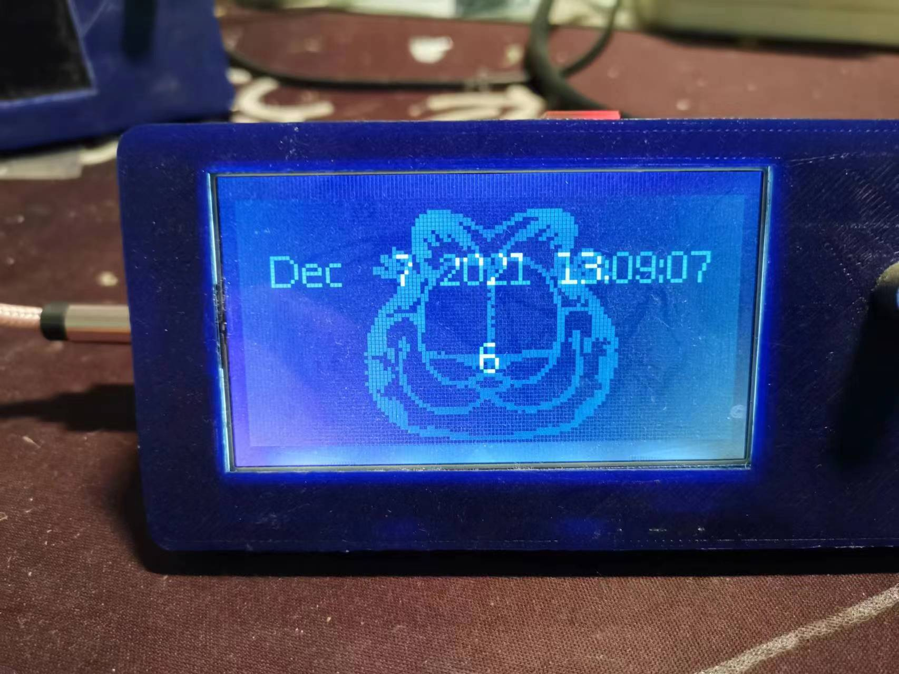
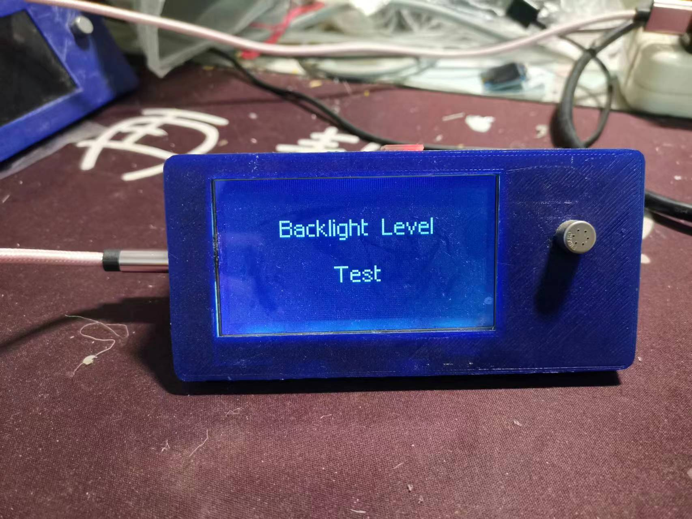
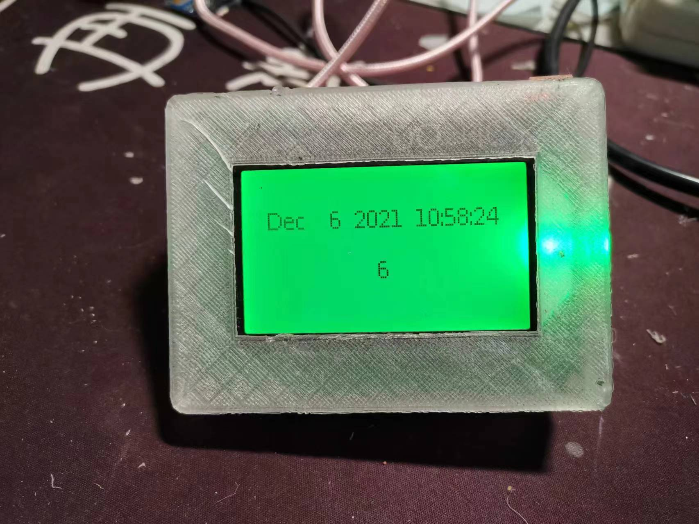

# ESP12-WeatherStation-I2C-12864-HeWeather-zh

ESP-12 (ESP8266) weather station: shows local outside weather + a 5-day
forecast on a 128x64 SPI LCD, plus an internal DHT temperature/humidity
sensor reading and a smoke-alarm buzzer/LED. Optionally also cycles through
two additional world cities' current conditions.

 
 
 

## Setup

1. Install dependencies: `U8g2`, `WiFiManager`, `DHT sensor library` (+
   `Adafruit Unified Sensor`), `Timezone`, `JsonStreamingParser`.
2. This sketch vendors two shared dependencies directly so it builds
   standalone - **replace their placeholder credentials/locations before
   flashing**:
   - `WeatherApiWeather.h`/`.cpp` ([source](https://github.com/bobhuang1/esp8266-weather-WeatherApi)) -
     set `WEATHERAPI_LOCATION` (and `WEATHERAPI_LOCATION1`/`WEATHERAPI_LOCATION2`
     if you enable `SHOW_US_CITIES`) below the `#include`s to real city names,
     and set `WEATHERAPI_APP_ID` in `GarfieldCommon.h` to your
     [WeatherAPI.com](https://www.weatherapi.com/) key.
   - `GarfieldCommon.h`/`.cpp` ([source](https://github.com/bobhuang1/ESP8266-Garfield-Common)) -
     see that repo's README for the full placeholder list (WiFi
     credentials) and security notes.
   - If you update either shared library, re-copy the files here.
3. `#define SHOW_US_CITIES` (disabled by default) also cycles through two
   more cities' current conditions between the local weather and forecast
   pages.
4. `#define USE_LED` / `USE_HIGH_ALARM` / `USE_OLD_LED` select the
   smoke-detector alarm wiring variant for a particular built unit - see the
   comments next to each `#define` at the top of the .ino.

## Notes

- Originally used a now-defunct HeWeather API endpoint; migrated to
  [WeatherAPI.com](https://www.weatherapi.com/) (see
  [esp8266-weather-WeatherApi](https://github.com/bobhuang1/esp8266-weather-WeatherApi)).
  Because WeatherAPI.com returns current conditions + forecast in a single
  request, this sketch now refreshes both together on the same interval
  (`UPDATE_INTERVAL_SECS`) instead of fetching the forecast separately only a
  few times a day as the old code did.
- WeatherAPI.com's daily forecast has one overall condition per day (not a
  separate day/night pair) and a peak wind speed with no direction - the
  forecast page's wind/condition display was adjusted accordingly. See
  esp8266-weather-WeatherApi's README for details.
- `#define LANGUAGE_CN` / comment it out to switch the on-screen text between
  Chinese and English.
